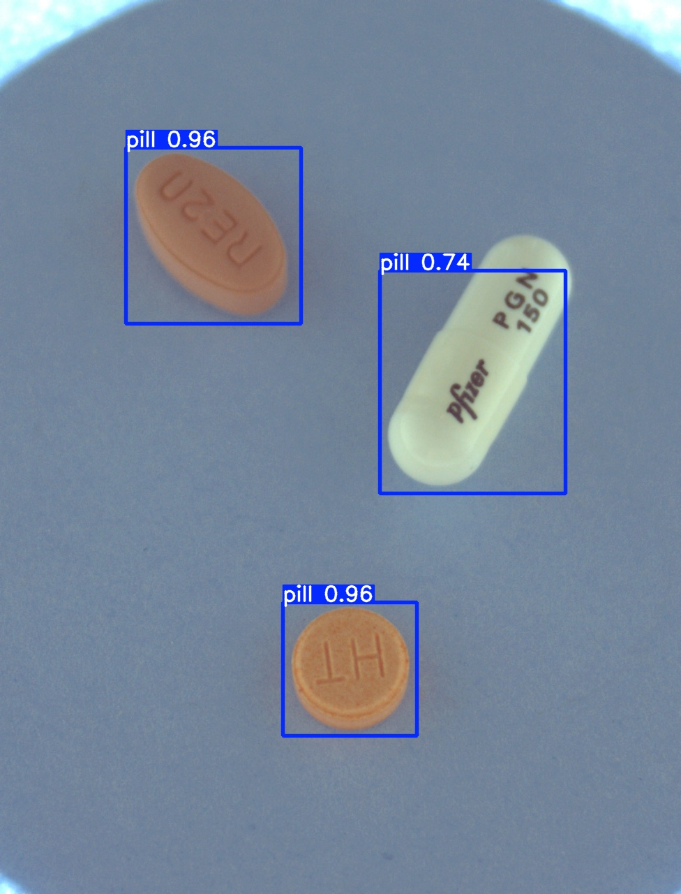
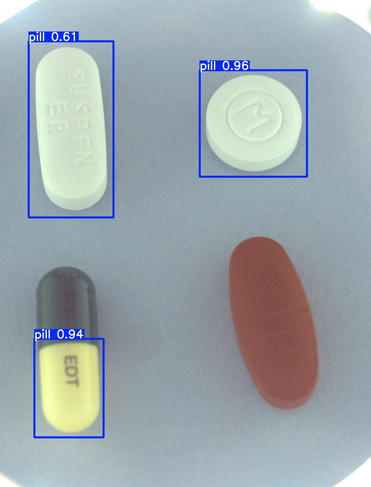

# 베이스 모델 정의
 
✅ YOLOv8-detect 베이스 모델

| 항목              | 설명                   | 예시                                        |
| --------------- | -------------------- | ----------------------------------------- |
| 1. 모델 구조 파일     | [args.yaml](./yolov8n_detect/args.yaml)      | `detect.yaml`, `model.py`, `.json`        |
| 2. 모델 가중치 파일    | [detect_best.pt](./yolov8n_detect/best.pt) | `best.pt`, `yolov8n.pt`                   |
| 3. Inference 코드 | - yolov8n 모델을 사용하여 객체 탐지 수행  - 입력: 알약 이미지  - 출력:   - 명령어: [CLI명령어](./yolov8n_detect/inference) | `detect.py`, `inference.py`               |
| 4. 사용 설명서       | 입력 형식, 실행법 등 포함 문서   | `README.md`, `사용자 가이드.docx`               |
| 5. 라벨 또는 클래스 정의 | 탐지 대상 클래스 정보         | `classes.txt`, `label_map.json`           |
| 6. 예시 데이터 및 결과  |        | `example_input.jpg`, `output_result.json` |
 

✅ YOLOv8n-cls 베이스 모델

| 항목              | 설명               | 예시                                        |
| --------------- | ---------------- | ----------------------------------------- |
| 1. 모델 구조 파일     | 이미지 분류 모델 구조 정의  | `cls.yaml`, `model.py`, `.json`           |
| 2. 모델 가중치 파일    | 학습된 분류 모델 파라미터   | `yolo11m-cls.pt`, `.ckpt`                 |
| 3. Inference 코드 | 분류 실행 코드         | `predict.py`, `classify.py`               |
| 4. 사용 설명서       | 분류 모델 사용법 포함 문서  | `README.md`, `분류_사용법.docx`                |
| 5. 라벨 또는 클래스 정의 | 클래스 인덱스/이름 매핑    | `classes.txt`, `label_map.json`           |
| 6. 예시 데이터 및 결과  | 이미지 입력과 분류 결과 예시 | `sample_image.jpg`, `predict_result.json` |
